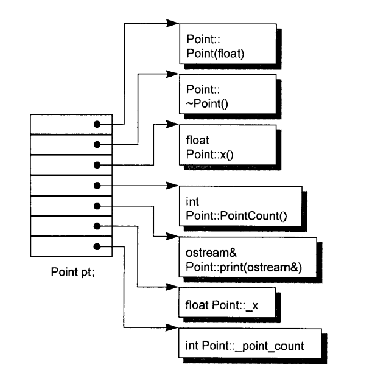
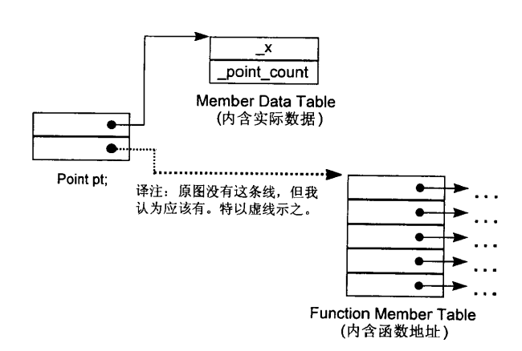
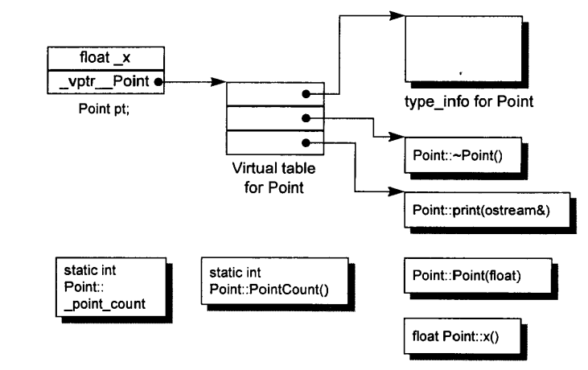
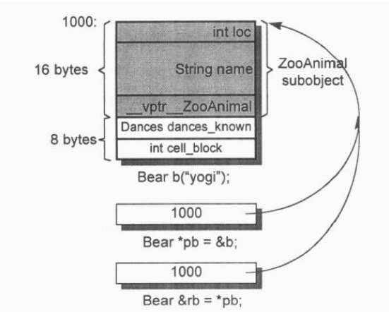

#第1章 关于对象（Object Lessons）
###加上封装后的布局成本
C++在布局以及存取时间上主要的额外负担是由`virtual`引起，包括：

- **virtual function机制** 用以支持一个有效率的“执行期绑定”。
- **virtual base class** 用以实现“多次出现在继承体系中的base class，有一个单一而被共享的实体”。

## 1.1 C++对象模式
在C++中，有两种class data members: static和nonstatic，以及三种class member functions: static、nonstatic和virtual。已知下面这个class Point声明：

```C++
class Point {
public:
	Point( float xval );
	virtual ~Point();

	float x() const;
	static int PointCount();

protected:
	virtual ostream&
		print( ostream &os ) const;

	float _x;
	static int _point_count;
};
```

###简单对象模型
第一个模型十分简单。它可能是为了尽量降低C++编译器的设计复杂度而开发出来的，赔上的则是空间和执行期的效率。在这个简单模型中，一个object是一系列的slots，每一个slot指向一个members。Members按其声明次序，各被指定一个slot。每一个data member或function member都有自己的一个slot。



虽然这个模型并没有被应用于实际产品上，不过关于索引或slot数目的观念，倒是被应用到C++的“指向成员的指针”观念之中。

###表格驱动对象模型
为了所有classes的所有objects都有一致的表达方式，另一种对象模型是把所有与members相关的信息抽出来，放在一个data member table和一个member function table之中，class object本身则内含指向这两个表格的指针。Member function table是一系列的slots，每一个slot指出一个member function；Data member table则直接含有data本身。



虽然这个模型也没有实际应用于真正的C++编译器身上，但member function table这个观念却成为支持virtual function的一个有效方案。

###C++对象模型
Stroustrup当初设计的C++对象模型是从简单对象模型派生而来的，并对内存空间和存取时间做了优化。在此模型中，Nonstatic data members被配置于每一个class object之内，static data members则被存放在所有的class object之外。Static和nonstatic function members也被放在所有的class object之外。Virtual functions则以两个步骤支持之：

1. 每一个class产生出一堆指向virtual functions的指针，放在表格之中。这个表格被称为virtual table（**vtbl**）。
2. 每一个class object被添加了一个指针，指向相关的virtual table。通常这个指针称为**vptr**。vptr的设定和重置都由每一个class的constructor、destructor和copy assignment运算符自动完成。每一个class所关联的type_info object（用以支持runtime type identification, RTTI）也经由virtual table被指出来，通常是放在表格的第一个slot处。



####加上继承
一个derived class如何在本质上塑模其base class的实体呢？在“简单对象模型”中，每一个base class可以被derived class object内的一个slot指出，该slot内含base class subobject的地址。这个体制的主要缺点是，因为间接性而导致空间和存取时间上的额外负担，优点则是class object的大小不会因其base classes的改变而受到影响。

另一种base table模型：产生base class table，表格中得每一个slot内含一个相关的base class地址，这很像virtual table内含每一个virtual function的地址一样。每一个class object内含一个bptr，它会被初始化，指向其base class table。这种策略的主要缺点是由于间接性而导致的空间和存取时间上的额外负担，优点则是在每一个class object中对于继承都有一致的表现方式：每一个class object都应该在某个固定位置上安放一个base table指针，与base classes的大小或数目无关。第二个优点是，不需要改变class objects本身，就可以放大、缩小、或更改base class table。

C++最初采用的继承模型并不运用任何间接性：base class subobject的data members被直接放置于derived class object中。这提供了对base class members最紧凑而且最有效率的存取。缺点就是：base class members的任何改变，包括增加、移除或改变类型等等，都使得所有用到“此base class或其derived class之objects”者必须重新编译。

###对象模型如何影响程序
不同的对象模型会导致“现有的程序代码必须修改”以及“必须加入新的程序代码”两个结果。例如：

```C++
// X定义了一个copy constructor，一个virtual destructor，和一个virtual function foo
X foobar()
{
	X xx;
	X *px = new X;
	
	// foo() 是一个virtual function
	xx.foo();
	px->foo();
	
	delete px;
	return xx;
}

// 这个函数有可能在内部被转化为：
void foobar(x &_result)
{
	// 构造_result
	// _result用来取代local xx ...
	_result.X::X();
	
	// 扩展X *px = new X;
	px = _new( sizeof( X ) );
	if ( px != 0 )
		px->X::X();
	
	// 扩展xx.foo()但不使用virtual机制
	// 以_result取代xx
	foo( &_result );
	
	// 使用virtual机制扩展px->foo()
	( *px->vtbl[2] )( px );
	
	// 扩展delete px;
	if ( px != 0 ) {
		( *px->vtbl[1] )(px); // destructor
		_delete(px);
	}
	
	// 不需使用named return statement
	// 不需要摧毁local object xx
	return;
}
```

## 1.2 关键词所带来的差异
如果不是为了努力维持与C之间的兼容性，C++远可以比现在更简单些。如果C++并不需要支持C原有的struct，那么class的观念可以借由关键词class来支持。

### 关键词的困扰
什么时候一个人应该使用struct取代class？关键词struct本身并不一定要象征其后随之声明的任何东西。我们可以使用struct代替class，但仍然声明public、protected、private等等存取区段，以及一个完全public的接口，以及virtual functions，以及单一继承、多重继承、虚拟继承等等。

### 策略性正确的struct
C struct在C++中的一个合理用途，是当你要传递“一个复杂的class object的全部或部分”到某个C函数中去时，struct声明可以将数据封装起来，并保证拥有与C兼容的空间布局。然而这项保证只在组合的情况下才存在。如果是“继承”而不是“组合”，编译器会决定是否应该有额外的data members被安插到base struct subobject之中。


## 1.3 对象的差异
C++程序设计模型直接支持三种programming paradigms：

1. **程序模型**，就像C一样，C++当然也支持它。

```C++
char body[] = "Danny";
char *p_son;
...
p_son = new char[ strlen( boy ) + 1 ];
strcpy( p_son, boy );
...
if ( !strcmp(p_son, boy) )
	take_to_disneyland(boy);
```

2. **抽象数据类型模型**。该模型所谓的“抽象”是和一组表达式一起提供，而其运算定义仍然隐而未明。

```C++
String girl = "Anna";
String daughter;
...
// String::operator=();
daughter = girl;
...
// String::operator==();
if ( girl == daughter )
	take_to_disneyland(girl);
```

3. **面向对象模型**。在此模型中有一些彼此相关的类型，通过一个抽象的base class（用以提供共通接口）被封装起来。

```C++
void
check_in(Library_materials *pmat)
{
	if (pmat->late())
		pmat->fine();		
	pmat->check_in();
	
	if (Lender *plend = pmat->reserved())
		pmat->notify(plend);
}
```

纯粹以一种paradigm写程序，有助于整体行为的良好稳固。然而如果混合了不同的paradigms，就可能会带来让人惊吓的后果，特别是在没有谨慎处理的情况下，最常见的疏忽发生在当你以一个base class的具体实体如：

```C++
Library_materials thing1;
```

来完成某种多态局面时：

```C++
// class Book : public Library_materials { ... };
Book book;

// thing1不是一个Book
// book被裁切了
// 不过thing1仍保有一个Library_materials
thing1 = book;

// 调用的是Library_materials::check_in()
thing1.check_in();
```

而不是通过base class的pointer或reference来完成多态局面：

```C++
Library_materials &thing2 = book;

thing2.check_in();
```

虽然你可以直接或间接处理继承体系中的一个base class object，但只有通过pointer或reference的间接处理，才支持OO程序设计所需的多态性质。上个例子中得thing2的定义和运用，是OO paradigm中一个良好的例证。thing1的定义和运用则逸出了OO的习惯：它反映的是一个ADT paradigm的良好行为。thing1的行为是好是坏，视程序员的意图而定。在此范例中，它的行为非常有可能不是你要的！

在OO paradigm之中，程序员需要处理一个未知实体，它的类型虽然有所界定，却有无穷可能。这组类型受限于其继承体系，然而该体系理论上没有深度和广度的限制。原则上，所指定的object的真实类型在每一个特定执行点之前，是无法解析的。在C++中，只有通过pointers和references的操作才能够完成。相反地，在ADT paradigm中程序员处理的是一个拥有固定而单一类型的实体，它在编译时期就已经完全定义好了。举例：

```C++
// 描述objects：不确定类型
Library_materials *px = retrieve_some_material();
Library_materials &rx = *px;

// 描述已知物：不可能有令人惊讶的结果产生
Library_materials dx = *px;
```

C++以下列方法支持多态：

1. 经由一组隐含的转化操作。例如把一个derived class指针转化为一个指向其public base type的指针：

```C++
shape *ps = new circle();
```

2. 经由virtual function机制：

```C++
ps->rotate();
```

3. 经由dynamic_cast和typeid操作符：

```C++
if ( circle *pc = dynamic_cast< circle* > ( ps ) ) ...
```

多态的主要用途是经由一个共同的接口来影响类型的封装，这个接口通常被定义在一个抽象的base class中。这个共享接口是以virtual function机制引发的，它可以在执行期根据object的真正类型解析出到底是哪一个函数实体被调用。

需要多少内存才能够表现一个class object？一般而言要有：

- 其nonstatic data members的总和大小；
- 加上任何由于alignment的需求而填补上去的空间（可能存在于members之间，也可能存在于集合体边界）；
- 加上为了支持virtual而由内部产生的任何额外负担。

###指针的类型
“指向不同类型之各指针”间的差异，既不在其指针表示法不同，也不在其内容（代表一个地址）不同，而是在其所寻址出来的object类型不同。也就是说，“指针类型”会教导编译器如何解释某个特定地址中的内存内容及其大小。转型其实是一种编译器指令。大部分情况下它并不改变一个指针所含的真正地址，它只影响“被指出之内存的大小和其内容”的解释方式。

###加上多态之后
```C++
class ZooAnimal {
public:
	ZooAnimal();
	virtual ~ZooAnimal();
	// ...
	virtual void rotate();

protected:
	int loc;
	String name;
};

class Bear : public ZooAnimal {
public:
	Bear();
	~Bear();
	// ...
	void rotate();
	virtual void dance();
	// ...
protected:
	enum Dances { ... };

	Dances dances_known;
	int cell_block;
};

Bear b( "Yogi" );
Bear *pb = &b;
Bear &rb = *pb;
```

b、pb、rb会有怎样的内存需求呢？不管是pointer或reference都只需要一个word空间。Bear object需要24bytes，也就是ZooAnimal的16bytes加上Bear所带来的8bytes。



假设我们的Bear object放在地址1000处，一个Bear指针和一个ZooAnimal指针有什么不同？

```C++
Bear b;
ZooAnimal *pz = &b;
Bear *pb = &b;
```

它们每个都指向Bear object的第一个byte。其间的差别是，pb所涵盖的地址包含整个Bear object，而pz所涵盖的地址只包含Bear object中的ZooAnimal subobject。

除了ZooAnimal subobject中出现的members，你不能够使用pz来直接处理Bear的任何members。唯一例外是通过virtual机制：

```C++
// 不合法：cell_block不是ZooAnimal的一个member，
// 虽然我们知道pz当前指向一个Bear object。
pz->cell_block;

// ok：经过一个明白的downcast操作就没有问题！
(( Bear* )pz)->cell_block;

// 下面这样更好，但它是一个run-time operation
if ( Bear* pb2 = dynamic_cast< Bear* >( pz ))
	pb2->cell_block;

// ok：因为cell_block是Bear的一个member。
pb->cell_block;
```

当我们写：`pz->rotate();`时，pz的类型将在编译时期决定以下两点：

- 固定的可用接口。也就是说，pz只能够调用ZooAnimal的public接口；
- 该接口的access level（例如rotate()是ZooAnimal的一个public member）。

在每一个执行点，pz所指的object类型可以决定rotate()所调用的实体。类型信息的封装并不是维护于pz之中，而是维护于link之中，此link存在于“object的vptr”和“vptr所指之virtual table”之间。

现在，请看这种情况：

```C++
Bear b;
ZooAnimal za = b; // 这会引起切割

// 调用ZooAnimal::rotate()
za.rotate();
```

为什么rotate()所调用的是ZooAnimal实体而不是Bear实体？此外，如果初始化函数将一个object内容完整拷贝到另一个object中去，为什么za的vptr不指向Bear的virtual table？

第二个问题的答案是，编译器在（1）初始化及（2）指定操作（将一个class object指定给另一个class object）之间做出了仲裁。编译器必须确保如果某个object含有一个或一个以上的vptrs，那些vptrs的内容不会被base class object初始化或改变。

至于第一个问题的答案是：za并不是一个Bear，它是一个ZooAnimal。多态所造成的“一个以上的类型”的潜在力量，并不能够实际发挥在“直接存取objects”这件事情上。

一个pointer或一个reference之所以支持多态，是因为它们并不引发内存中任何“与类型相关的内存委托操作”；会受到改变的只是它们所指向的内存的“大小和内容解释方式”而已。

总而言之，多态是一种威力强大的设计机制，允许你继一个抽象的public接口之后，封装相关的类型。需要付出的代价就是额外的间接性——不论是在“内存的获得”或是在“类型的决断”上，C++通过class的pointers和references来支持多态，这种程序设计风格就称为“面向对象”。

C++也支持具体的ADT程序风格，如今被称为object-based（OB）。一个OB设计可能比一个对等的OO设计速度更快而且空间更紧凑。速度快是因为所有的函数引发操作都在编译时期解析完成，对象建构起来时不需要设置virtual机制；空间紧凑则是因为每一个class object不需要负担传统上为了支持virtual机制而需要的额外负荷。不过，OB设计比较没有弹性。