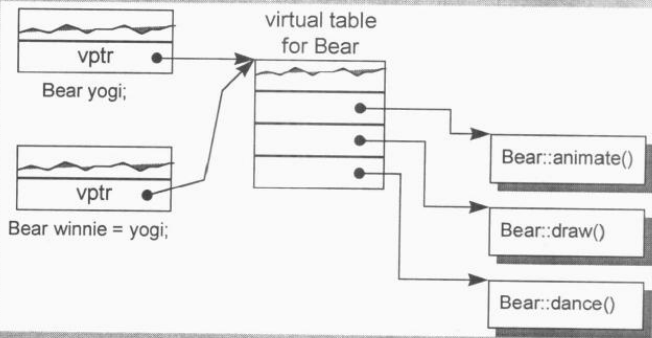
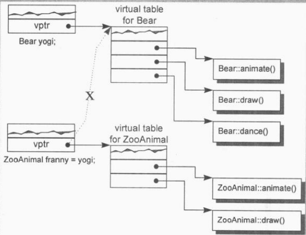
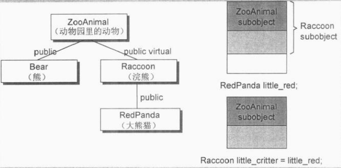

#第2章 构造函数语意学（The Semantics of Constructors）

- **implicit**：暗中的、隐含的（通常意指并非在程序源代码中出现的）
- **explicit**：明确的（通常意指程序源代码中所出现的）
- **trivial**：没有用的
- **nontrivial**：有用的
- **memberwise**：对每一个member施以
- **bitwise**：对每一个bit施以

##Default Constructor的建构操作
> 对于class X，如果没有任何user-declared constructor，那么会有一个default constructor被暗中（implicitly）声明出来……一个被暗中声明出来的default constructor将是一个trivial（浅薄而无能，没啥用的）constructor……

下面分别讨论nontrivial default constructor的四种情况：

###“带有Default Constructor”的Member Class Object
如果一个class没有任何constructor，但它内含一个member object，而后者有default constructor，那么这个class的implicit default constructor就是“nontrivial”，编译器需要为此class合成出一个default constructor。不过这个合成操作只有在constructor真正需要被调用时才会发生。

在C++各个不同的编译器模块中，编译器如何避免合成出多个default constructor呢？解决方法是把合成的default constructor、copy constructor、destructor、assignment copy operator都以inline方式完成。一个inline函数有静态链接，不会被档案以外者看到。如果函数太复杂，不适合做成inline，就会合成出一个explicit non-inline static实体。

举个例子，在下面的程序片段中，编译器为class Bar合成一个default constructor：

```C++
class Foo { public: Foo(), Foo(int) ... };
class Bar { public: Foo foo; char *str; };

void foo_bar()
{
	Bar bar; // Bar::foo 必须在此处初始化
             // Bar::foo是一个member object，而其class Foo
			 // 拥有default constructor

	if (str) {} ...
}
```

被合成的Bar default constructor内含必要的代码，能够调用class Foo的default constructor来处理member object Bar::foo，但它并不产生任何买代码来初始化Bar::str。是的，将Bar::foo初始化是编译器的责任，将Bar::str初始化则是程序员的责任。被合成的default constructor看起来可能像这样：

```C++
inline
Bar::Bar()
{
	foo.Foo::Foo();
}
```

为了让这个程序片段能够正确执行，字符指针str也需要被初始化。让我们假设程序员经由下面的default constructor提供了str的初始化操作：

```C++
Bar::Bar() { str = 0; }
```

现在程序的需求获得满足了，但是编译器还需要初始化member object foo。由于default constructor已经被明确地定义出来，编译器没办法合成第二个。编译器的行动是“如果class A内含一个或一个以上的member class objects，那么class A的每一个constructor必须调用每一个member class的default constructor”。编译器会扩展已存在的constructors，在其中安插一些代码，使得user code在被执行之前，先调用必要的default constructors。

```C++
Bar::Bar()
{
	foo.Foo::Foo();
	str = 0;
}
```

如果有多个class member objects都要求constructor初始化操作，将如何呢？C++语言要求以“member objects在class中的声明次序”来调用各个constructors。这一点由编译器完成，它为每一个constructor安插程序代码，以“member声明次序”调用每一个member所关联的default constructors。这些代码将被安插在explicit user code之前。

###“带有Default Constructor”的Base Class
如果一个没有任何constructors的class派生自一个“带有default constructor”的base class，那么这个derived class的default constructor会被视为nontrivial，并因此需要被合成出来。它将调用上一层base classes的default constructor（根据它们的声明次序）。对一个后继派生的class而言，这个合成的constructor和一个“被明确提供的default constructor”没有什么差异。

###“带有一个Virtual Function”的Class
- class声明（或继承）一个virtual function
- class派生自一个继承串链，其中有一个或更多的virtual base classes

```C++
class Wdiget {
public:
	virtual void flip() = 0;
};

void flip(const Widget& widget) { widget.flip(); }

// 假设Bell和Whistle都派生自Widget
void foo()
{
	Bell b;
	Whistle w;

	flip(b);
	flip(w);
}
```

下面两个扩张操作会在编译期间发生：

1. 一个virtual function table（在cfront中被称为vtbl）会被编译器产生出来，内放class的virtual functions地址。
2. 在每一个class object中，一个额外的pointer member（也就是vptr）会被编译器合成出来，内含相关的class vtbl的地址。 

此外，`widget.flip()`的虚拟引发操作会被重新改写，以使用widget的vptr和vtbl的`flip()`条目：

```C++
// widget.flip()的虚拟引发操作的转变
(*widget.vptr[1])(&widget)
```

为了让这个机制发挥功效，编译器必须为每一个Widget（或其派生类之）object的vptr设定初值，放置适当的virtual table地址。对于class所定义的每一个constructor，编译器会安插一些代码来做这些事情。对于那些未声明任何constructors的classes，编译器会为它们合成一个default constructor，以便正确地初始化每一个class object的vptr。

###“带有一个Virtual Base Class”的Class
Virtual base class的实现法在不同的编译器之间有极大的差异。然而，每一种实现法的共通点在于必须使virtual base class在其每一个derived class object中的位置，能够于执行期准备妥当。

```C++
class X { public: int i; };
class A : public virtual X { public: int j; };
class B : public virtual X { public: double d; };
class C : public A, public B { public: int k; };

// 无法在编译时期决定出pa->X::i的位置
void foo(const A* pa) { pa->i = 1024; }

main()
{
	foo(new A);
	foo(new C);
	// ...
}
```

编译器无法固定住foo()之中“经由pa而存取的X::i”的实际偏移位置，因为pa的真正类型可以改变，编译器必须改变“执行存取操作”的那些代码，使X::i可以延迟至执行期才决定下来。原先cfront的做法是靠“在derived class object的每一个virtual base classes中安插一个指针”完成。所有“经由reference或pointer来存取一个virtual base class”的操作都可以通过相关指针完成。

```C++
// 可能的编译器转变操作
void foo(const A* pa) { pa->__vbcX->i = 1024; }
```

其中`__vbcX`表示编译器所产生的指针，指向virtual base class X。`__vbcX`是在class object建构期间被完成的。对于class所定义的每一个constructor，编译器会安插那些“允许每一个virtual base class的执行期存取操作”的代码。如果class没有声明任何constructors，编译器必须为它合成一个default constructor。

###总结
有四种情况，会导致“编译器必须为未声明constructor之classes合成一个default constructor”。C++ Standard把那些合成物称为implicit nontrivial default constructors。被合成出来的constructor只能满足编译器的需要。它之所以能够完成任务，是借着“调用member object或base class的default constructor”或是“为每一个初始化其virtual function机制或virtual base class机制”而完成。至于没有存在那四种情况而又没有声明任何constructor的classes，我们说它们拥有的是implicit trivial default constructors，它们实际上并不会被合成出来。

在合成的default constructor中，只有base class subobjects和member class objects会被初始化。所有其它的nonstatic data member，如整数、整数指针、整数数组等等都不会被初始化。如果程序需要一个“把某指针设为0”的default constructor，那么提供它的人应该是程序员。

##Copy Constructor的建构操作
有三种情况，会以一个object的内容作为另一个class object的初值。最明显的一种情况当然就是对一个object做明确的初始化操作，像这样：

```C++
Class X { ... };
X x;

// 明确地以一个object的内容作为另一个class object的初值
X xx = x;
```

另两种情况是当object被当作参数交给某个函数时，例如：

```C++
extern void foo(X x);

void bar()
{
	X xx;
	
	// 以xx作为foo()第一个参数的初值（不明显的初始化操作）
	foo(xx);

	// ...
}
```

以及当函数传回一个class object时，例如：

```C++
X
foo_bar()
{
	X xx;
	// ...
	return xx;
}
```

假设class设计者明确定义了一个copy constructor（这是一个constructor，有一个参数的类型是其class type），像下面这样：

```C++
// user-defined copy constructor的实例
// 可以是多参数形式，其第二参数及后继参数以一个默认值供应之

X::X(const X& x);
Y::Y(const Y& y, int = 0);
```

那么在大部分情况下，当一个class object以另一个同类实体作为初值时，上述的constructor会被调用。这可能会导致一个暂时性class object的产生或程序代码的蜕变（或两者都有）。

###Default Memberwise Initialization
如果class没有提供一个explicit copy constructor又当如何？当class object以“相同class的另一个object”作为初值时，其内部是以所谓的default memberwise initialization手法完成的，也就是把每一个内建的或派生的data member（例如一个指针或一数组）的值，从某个object拷贝一份到另一个object身上。不过它并不会拷贝其中的member class object，而是以递归的方式施行memberwise initialization。

```C++
class String {
public:
	// ... 没有explicit copy constructor
private:
	char *str;
	int len;
};
```

一个String object的default memberwise initialization发生在这种情况之下：

```C++
String noun("book");
String verb = noun;

// 语意相等
verb.str = noun.str;
verb.len = noun.len;
```

如果一个String object被声明为另一个class的member，像这样：

```C++
class Word {
public:
	// ... 没有explicit copy constructor
private:
	int _occurs;
	String _word; // String object成为class Word的一个member
};
```

那么一个Word object的default memberwise initialization会拷贝其内建的member _occurs，然后再于String member object _word身上递归实施memberwise initialization。

> 一个class object可以从两种方式复制得到，一种是被初始化，另一种是被指定。从概念上而言，这两个操作分别是以copy constructor和copy assignment operator完成的。

就像default constructor一样，C++ Standard上说，如果class没有声明一个copy constructor，就会有隐含的声明或隐含的定义出现。和以前一样，C++ Standard把copy constructor区分为trivial和nontrivial两种。只有nontrivial的实体才会被合成于程序之中。决定一个copy constructor是否为trivial的标准在于class是否展现出所谓的“bitwise copy semantics”。

###Bitwise Copy Semantics（位逐次拷贝）
```C++
#include "Word.h"

Word noun("book");

void foo()
{
	Word verb = noun;
	// ...
}

// 以下声明展现了bitwise copy semantics
class Word {
public:
	Word(const char*);
	~Word() { delete [] str; }
	// ...
private:
	int cnt;
	char *str;
};
```

这种情况下并不需要合成出一个default copy constructor，因为上述声明展现了“default copy semantics”，而verb的初始化操作也就不需要以一个函数调用收场。然后，如果class Word是这样声明：

```C++
class Word {
public:
	Word(const String&);
	~Word();
	// ...
private:
	int cnt;
	String str;
};
```

其中String声明了一个explicit copy constructor：

```C++
class String {
public:
	String(const char*);
	String(const String&);
	~String();	
	// ...
};
```

在这个情况下，编译器必须合成出一个copy constructor以便调用member class String object的copy constructor：

```C++
// 一个被合成出来的copy constructor
// C++伪代码
inline Word::Word(const Word& wd)
{
	str.String::String(wd.str);
	cnt = wd.cnt;
}
```

有一点很值得注意：在这被合成出来的copy constructor中，如整数、指针、数组等等的nonclass members也都会被复制。

###不要Bitwise Copy Semantics！
什么时候一个class不展现出“bitwise copy semantics”呢？有四种情况：

1. 当class内含一个member object而后者的class声明有一个copy constructor时（不论是被class设计者明确地声明，或是被编译器合成）。
2. 当class继承自一个base class而后者存在有一个copy constructor时。
3. 当class声明了一个或多个virtual functions时。
4. 当class派生自一个继承串链，其中有一个或多个virtual base classes时。

###重新设定的指针Virtual Table
回忆编译期间的两个程序扩张操作（只要有一个class声明了一个或多个virtual functions就会如此）：

- 增加一个virtual function table（vtbl），内含每一个有作用的virtual function的地址。
- 将一个指向virtual function table的指针（vptr），安插在每一个class object内。

很明显，如果编译器对于每一个新产生的class object的vptr不能成功而正确地设好其初值，将导致可怕的后果。因此，当编译器导入一个vptr到class之中时，该class就不再展现bitwise semantics了。现在，编译器需要合成出一个copy constructor，以求将vptr适当地初始化，下面是个例子。

```C++
class ZooAnimal {
public:
	ZooAnimal();
	virtual ~ZooAnimal();

	virtual void animate();
	virtual void draw();
	// ...

private:
	// ZooAnimal的animate()和draw()
	// 所需要的数据
};

class Bear : public ZooAnimal {
public:
	Bear();
	void animate(); // 虽未明写virtual，它其实是virtual
	void draw(); // 虽未明写virtual，它其实是virtual
	virtual void dance();
	// ...
private:
	// Bear的animate()和draw()和dance()
	// 所需要的数据
};
```

ZooAnimal class object以另一个ZooAnimal class object作为初值，或Bear class object以另一个Bear class object作为初值，都可以直接靠“bitwise copy semantics”完成（除了可能会有的pointer member之外）。举个例子：

```C++
Bear yogi;
Bear winnie = yogi;
```

yogi会被default Bear constructor初始化。而在constructor中，yogi的vptr被设定指向Bear class的virtual table（靠编译器安插的代码完成）。因此，把yogi的vptr值拷贝给winnie的vptr是安全的。



当一个base class object以其derived class的object内容做初始化操作时，其vptr复制操作也必须保证安全，例如：

```C++
ZooAnimal franny = yogi; // 这会发生切割行为
```

franny的vptr不可以被设定指向Bear class的virtual table（但如果yogi的vptr被直接“bitwise copy”的话，就会导致此结果），否则当下面程序片段中的draw()被调用而franny被传进去时，就会“炸毁”：

```C++
void draw(const ZooAnimal& zoey) { zoey.draw(); }
void foo() {
	// franny的vptr指向ZooAnimal的virtual table，
	// 而非Bear的virtual table
	ZooAnimal franny = yogi;
	
	draw(yogi); // 调用Bear::draw()
	draw(franny); // 调用ZooAnimal::draw()
}
```



###处理Virtual Base Class Subobject
Virtual base class的存在需要特别处理。一个class object如果以另一个object作为初值，而后者有一个virtual base class subobject，那么也会使“bitwise copy semantics”失效。

每一个编译器对于虚拟继承的支持承诺，都表示必须让“derived class object中的virtual base class subobject位置”在执行期就准备妥当。维护“位置的完整性”是编译器的责任。“Bitwise copy semantics”可能会破坏这个位置，所以编译器必须在它自己合成出来的copy constructor中做出仲裁。

```C++
class Raccoon : public virtual ZooAnimal {
public:
	Raccoon() { /* 设定private data初值 */ }
	Raccoon(int val) { /* 设定private data初值 */ }
	// ...
private:
	// 所有必要的数据
};
```

编译器所产生的代码（用以调用ZooAnimal的default constructor、将Raccoon的vptr初始化，并定位出Raccoon中的ZooAnimal subobject）被安插在两个Raccoon constructors之内，成为其先头部队。

```C++
class RedPanda : public Raccoon {
public:
	RedPanda(); { /* 设定private data初值 */ }
	RedPanda(int val) { /* 设定private data初值 */ }
	// ...
private:
	// 所有必要的数据
};

// 简单的bitwise copy就足够了
Raccoon rocky;
Raccoon little_critter = rocky;

// 简单的bitwise copy还不够，
// 编译器必须明确地将little_critter的
// virtual base class pointer/offset初始化
RedPanda little_red;
Raccoon little_critter = little_red;
```

在第二种情况下，为了完成正确的little_critter初值设定，编译器必须合成一个copy constructor，安插一些代码以设定virtual base class pinter/offset的初值（或只是简单地确定它没有被抹消），对每一个members执行必要的memberwise初始化操作，以及执行其他的内存相关工作。



##程序转换语意学（Program Transformation Semantics）
###明确的初始化操作（Explicit Initialization）
```C++
X x0;

void foo_bar() {
	X x1(x0);	
	X x2 = x0;
	X x3 = X(x0);
	// ...
}
```
必要的程序转化有两个阶段：

1. 重写每一个定义，其中的初始化操作会被剥除。
2. class的copy constructor调用操作会被安插进去。

```C++
// 可能的程序转换
// C++伪代码
void foo_bar() {
	X x1; // 定义被重写，初始化操作被剥除
	X x2;
	X x3;

	// 编译器安插X copy construction的调用操作
	// 表现出对X::X(const X& xx)的调用
	x1.X::X(x0);
	x2.X::X(x0);
	X3.X::X(x0);
	// ...
}
```

###参数的初始化（Argument Initialization）
```C++
X xx;
// ...
foo(xx); // void foo(X x0);
```

以上将会要求局部实体x0以memberwise的方式将xx当做初值。在编译器实现技术上，有一种策略是导入所谓的暂时性object，并调用copy constructor将它初始化，然后将该暂时性object交给函数。

```C++
// C++伪代码
// 编译器产生出来的暂时对象
X __temp0;

// 编译器对copy constructor的调用
__temp0.X::X(xx);

// 重新改写函数调用操作，以便使用上述的临时对象
foo(__temp0); // 以引用的形式调用

// 其中class X声明了一个destructor，它会在foo()函数完成之后被调用，对付那个暂时性的object
```

另一种实现方法是以“拷贝建构”（copy construct）的方式把实际参数直接建构在其应该的位置上，该位置视函数活动范围的不同记录于程序堆栈中。在函数返回之前，局部对象的destructor会被执行。

###返回值的初始化（Return Value Initialization）
```C++
X bar()
{
	X xx;
	// 处理xx ...
	return xx;
}
```

1. 首先加一个额外参数，类型是class object的一个referencee。这个参数将用来放置被“拷贝建构”而得的返回值。
2. 在return指令之前安插一个copy constructor调用操作，以便将欲传回之object的内容当做上述新增参数的初值。

```C++
// 函数转换以反映出copy constructor的应用
// C++伪代码
void
bar(X& __result)
{
	X xx;
	
	// 编译器所产生的default constructor调用操作
	xx.X::X();

	// ... 处理xx

	// 编译器所产生的copy constructor调用操作
	__result.X::X(xx);

	return;
}

// more
X xx = bar();

===>
X xx; // 注意，不必施行default constructor
bar(xx);

bar().memfunc(); // 执行bar()所传回之X class object的memfunc()

===>
X __temp0;
(bar(__temp0), __temp0).memfunc();

X (*pf)();
pf = bar;

===>
void (*pf)(X&);
pf = bar;
```

###在使用者层面做优化（Optimization at the User Level）
```C++
X bar(const T &y, const T &z)
{
	X xx;
	// 以y和x来处理xx
	return xx;
}

// 定义另一个constructor，可以直接计算xx的值
X bar(const T &y, const T &z)
{
	return X(y, z);
}

// C++伪代码
void 
bar(X &__result)
{
	__result.X::X(y, z);
	return;
}
```

###在编译器层面做优化（Optimization at the Compiler Level）
```C++
X bar()
{
	X xx;
	// ...处理xx
	return xx;
}

===>
void
bar(X &__result)
{
	// default constructor被调用
	// C++伪代码
	__result.X::X();
	
	// ...直接处理__result
	return;
}
```

这样的编译器优化操作，有时候被称为Named Return Value（NRV）优化。虽然NRV优化提供了重要的效率改善，它还是饱受批评。其中一个原因是，优化由编译器默默完成，而它是否真的被完成，并不十分清楚。第二个原因是，一旦函数变得比较复杂，优化也就变得比较难以施行。第三个批评则是从相反的方向出发，某些程序员真的不喜欢应用程序被优化。

###Copy Constructor：要还是不要？
```C++
class Point3d {
public:
	Point3d(float x, float y, float z);
private:
	float _x, _y, _z;
};
```

上述class的default copy constructor被视为trivial。三个坐标成员是以数值来储存。bitwise copy既不会导致memory leak，也不会产生address aliasing，因此它既快速又安全。没有任何理由要你提供一个copy constructor函数实体，因为编译器自动为你实施了最好的行为。比较难回答的是，如果你被问及是否预见class需要大量的memberwise初始化操作，例如以传值的方式传回objects？如果答案是yes，那么提供一个copy constructor的explicit inline函数实体就非常合理——在“你的编译器提供NRV优化”的前提下。

```C++
Point3d::Point3d(const Pint3d &rhs)
{
	memcpy(this, &rhs, sizeof(Point3d));
}
```

不管使用`memcpy()`或`memset()`，都只有在“classes不含任何由编译器产生的内部members”时才能有效运行。如果Point3d class声明一个或一个以上的virtual functions，或内含一个virtual base class，那么上述函数将会导致那些“被编译器产生的内部members”的初值被改写。

##成员们的初始化队伍（Member Initialization List）
下列情况中，为了让你的程序鞥能够被顺利编译，你必须使用member initialization list：

1. 当初始化一个reference member时；
2. 当初始化一个const member时；
3. 当调用一个base class的constructor，而它拥有一组参数时；
4. 当调用一个member class的constructor，而它拥有一组参数时。

```C++
class Word {
	String _name;
	int _cnt;
public:
	Word() {
		_name = 0;
		_cnt = 0;
	}
};

// C++伪代码
Word::Word( /* this pointer goes here */ )
{
	// 调用String的default constructor
	_name.String::String();

	// 产生临时性对象
	String temp = String(0);

	// memberwise地拷贝_name
	_name.String::operator=(temp);

	// 摧毁暂时性对象
	temp.String::~String();

	_cnt = 0;
}


// 得到一个明显更有效率的实现方法
Word::Word : _name(0)
{
	_cnt = 0;
}

// C++伪代码
Word::Word( /* this pinter goes here */ )
{
	// 调用String(int) constructor
	_name.String::String(0);
	_cnt = 0;
}
```

编译器会一一操作initialization list，以适当次序在constructor之内安插初始化操作，并且在任何explicit user code之前。list中的项目次序是由class中的members声明次序决定，不是由initialization list中的排列次序决定。“初始化次序”和“initialization list中的项目排列次序”之间的外观错乱，会导致下面意想不到的危险：

```C++
class X {
	int i;
	int j;
public:
	X(int val)
	: j(val), i(j)
	{}
// ...
};
```

另外，需要注意的是，initialization list的项目被放在explicit user code之前。