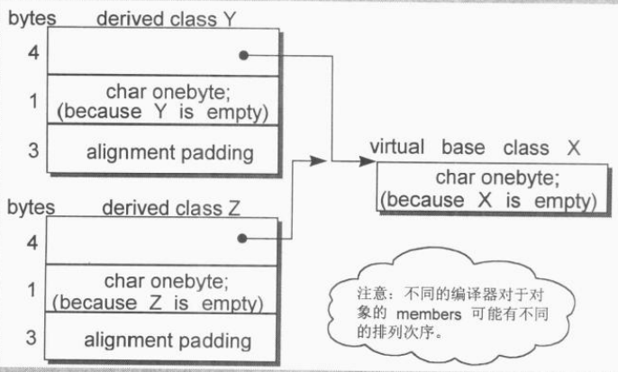
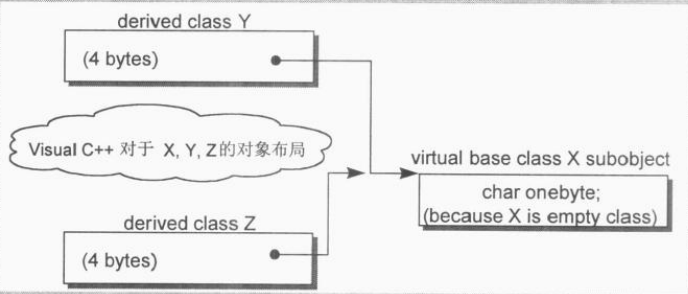
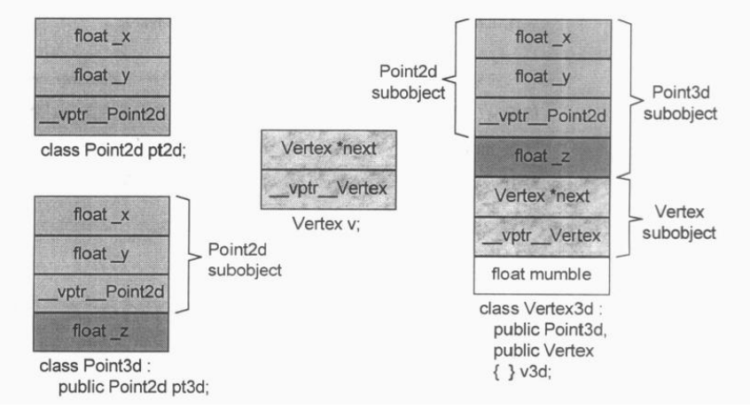
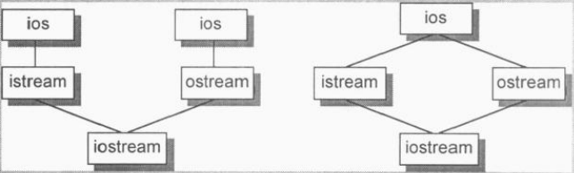
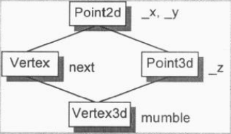
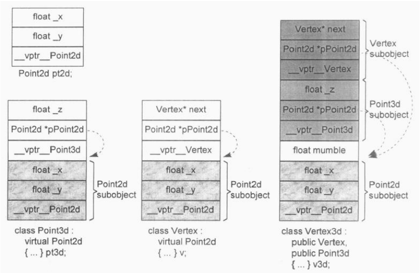
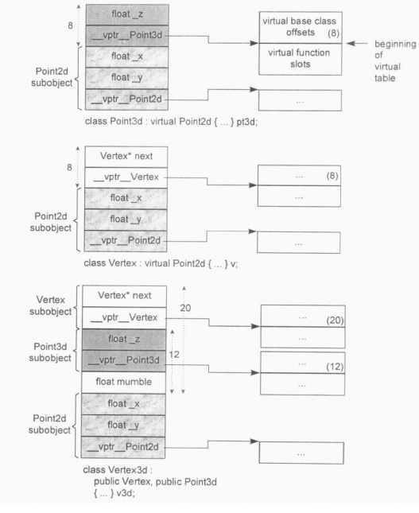

#Data语意学（The Semantics of Data）
```C++
class X {};
class Y : public virtual X {};
class Z : public virtual X {};
class A : public Y, public Z {};

// Intel Xeon x64, g++ version 4.9.2
// sizeof(X) = 1
// sizeof(Y) = sizeof(Z) = 8
// sizeof(A) = 16
```

`sizeof(X) = 1`表明X并不是空的，它有一个隐晦的1byte，那是被编译器安插进去的一个char。这使得这个class的两个objects得以在内存中配置独一无二的地址。

事实上Y和Z的大小受到三个因素的影响：

1. **语言本身所造成的额外负担（overhead）**。当语言支持virtual base classes时，就会导致一些额外负担。在derived class中，这个额外负担反映在某种形式的指针身上，它或者指向virtual base class subobject，或者指向一个相关表格；表格中存放的若不是virtual base class subobject的地址，就是其偏移量。
2. **编译器对于特殊情况所提供的优化处理**。Virtual base class X subobject的1 byte大小也会出现在class Y和Z身上。传统上它会被放在derived class的固定（不变动）部分的尾端。某些编译器会对empty virtual base class提供特殊支持。
3. **Alignment的限制**。alignment就是将数值调整到某数的整数倍。在32位计算机上，通常alignment为4bytes（32位），以使bus的“运输量”达到最高效率。



Empty virtual base class已经成为C++ OO设计的一个特有术语了。它提供了一个virtual interface，没有定义任何数据。某些新近的编译器对此提供了特殊处理。在这个策略之下，一个empty virtual base class被视为derived class object最开头的一部分，也就是它并没有花费任何的额外空间。



记住，一个virtual base class subobject只会在derived class中存在一份实体，不管它在class继承体系中出现了多少次。class A的大小由以下几点决定：

- 被大家共享的唯一一个class X实体，大小为1byte。
- Base class Y的大小，减去“因virtual base X而配置”的大小，结果是4bytes。Base class Z的算法亦同。加起来是8bytes。
- class A自己的大小：0byte。
- class A的alignment数量。前述三项总和，表示调整前的大小是9bytes。class A必须调整至4 bytes边界，所以需要填补3 bytes。结果是12bytes。

C++ Standard并不强制规定如“base class subobjects的排序次序”或“不同存取层级的data members的排列次序”这种琐碎细节。它也不规定virtual functions或virtual base classes的实现细节。

C++对象模型尽量以空间优化和存取速度优化的考虑来表现nonstatic data members，并且保持和C语言struct数据配置的兼容性。它把数据直接存放在每一个class object之中。对于继承而来的nonstatic data members（不管是virtual或nonvirtual base class）也是如此。不过并没有强制定义其间的排列顺序。至于static data members，则被放置在程序的一个global data segment中，不会影响个别的class object的大小。在程序之中，不管该class被产生出多少个objects（经由产生或间接派生），static data members永远只存在一份实体。但是一个template class的static data members的行为稍有不同。

每一个class object因此必须有足够的大小以容纳它所有的nonstatic data members。有时候其值可能令你吃惊，因为它可能比你想象的还大，原因是：

1. 由编译器自动加上的额外data members，用以支持某些语言特性（主要是各种virtual特性）。
2. 因为alignment的需要。

##3.1 Data Member的绑定（The Binding of a Data Member）
member rewriting rlue：一个inline函数实体，在整个class声明未被完全看见之前，是不会被评估请求的。其效果是，如果一个inline函数在class声明之后被定义的话，那么就还是对其评估求值。然而，对于member function的argument list并不为真。Argument list中的名称还是会在它们第一次遭遇时被适当地决议完成。请始终把“nested type声明”放在class的起始处。

```C++
extern int x;

class Pint3d {
public:
	// 对于函数本身的分析将延迟直至
	// class声明的右大括号出现才开始
	float X() const { return x; }
private:
	float x;
};

typedef int length;

class Point3d {
public:
	// length被决议为global
	void mumble(length val) { _val = val; }
	length mumble() { return _val; }

private:
	// length必须在“本class对它的第一个参考操作”之前被看见
	// 这样的声明将使先前的参考操作不合法
	typedef float length;
	length _val;
};
```

##3.2 Data Member的布局（Data Member Layout）
C++ Standard要求，在同一个access section（也就是private、public、protected等区段）中，members的排列只需符合“较晚出现的members在class object中有较高的地址”这一条件即可。也就是说，各个members并不一定得连续排列。members的边界调整可能就需要填补一些bytes。

编译器还可能会合成一些内部使用的data members，以支持整个对象模型，vptr就是这样的东西，当前所有的编译器都把它安插在每一个“内含virtual function之class”的object内。vptr的位置传统上它会被放在所有明确声明的members的最后。不过如今也有一些编译器把vptr放在一个class object的最前端。C++ standard秉持“对于布局所持的放任态度”，允许编译器把那些内部产生出来的members自由放在任何位置上，甚至放在那些被程序员声明出来的members之间。

##3.3 Data Member的存取
###Static Data Members
Static data members被编译器提出于class之外，并被视为一个global变量。每一个member的存取许可（private、protected或public），以及与class的关联，并不会导致任何空间上或执行时间上的额外负担——不论是在个别的class objects或是在static data member本身。

每一个static data member只有一个实体，存放在程序的data segment之中。每次程序取用static member，就会被内部转化为对该唯一的extern实体的直接参考操作。

如果有两个class，每一个都声明了一个static member freeList，那么当它们都被放在程序的data segment时，就会导致名称冲突。编译器的解决方法是暗中对每一个static data member编码（name-mangling），以获得一个独一无二的程序识别代码。任何name-mangling做法都有两个要点：

1. 一种算法，推导出独一无二的名称。
2. 万一编译系统（或环境工具）必须和使用者交谈，那些独一无二的名称可以轻易被推导回原来的名称。

###Nonstatic Data Members
Nonstatic data members直接存放在每一个class object之中。除非经由明确的（explicit）或暗喻的（implicit）class object，没有办法直接存取它们。只要程序员在一个member function中直接处理一个nonstatic data member，所谓“implicit class object”就会发生。

欲对一个nonstatic data member进行存取操作，编译器需要把class object的起始地址加上data member的偏移量。每一个nonstatic data member的偏移量在编译时期即可获知，甚至如果member属于一个base class subobject（派生自单一或多重继承串链）也是一样。因此，存取一个nonstatic data member，其效率和存取一个C struct member或一个nonderived class的member是一样的。

##3.4 “继承”与Data Member
在C++继承模型中，一个derived class object所表现出来的东西，是其自己的members加上其base class(es) members的总和。至于derived class members和base class(es) members的排列次序并未在C++ Standard中强制规定；理论上编译器可以自由安排之。在大部分编译器上头，base class members总是先出现，但属于virtual base class的除外。

###只要继承不要多态（Inheritance without Polymorphism）
一般而言，具体继承（concrete inheritance，相对于虚拟继承virtual inheritance）并不会增加空间或存取时间上的额外负担。

```C++
class Point2d {
public:
	Point2d(float x = 0.0, float y = 0.0)
		: _x(x), _y(y) {}

	float x() { return _x; }
	float y() { return _y; }

	void x(float newX) { _x = newX; }
	void y(float newY) { _y = newY; }
	
	void operator+=(const Point2d& rhs) {
		_x += rhs.x();
		_y += rhs.y();
	}
	// ... more members

protected:
	float _x, _y;
};

// inheritance from concrete class
class Point3d : public Point2d {
public:
	Point3d(float x = 0.0, float y = 0.0, float z = 0.0)
		: Point2d(x, y), _z(z) {}

	float z() { return _z; }
	void z(float newZ) { _z = newZ; }

	void operator+=(const Point3d& rhs) {
		Point2d::operator+=(rhs);
		_z += rhs.z();
	}
	// ... more members

protected:
	float _z;
};
```

把两个原本独立不相干的classes凑成一对“type/subtype”，并带有继承关系，会有什么易犯的错误呢？经验不足的人可能会重复设计一些相同操作的函数。以上面的例子中的constructor和operator+=为例，它们并没有被做成inline函数。Point3d object的初始化操作或加法操作，将需要部分的Point2d object和部分的Point3d object作为成本。一般而言，选择某些函数做成inline函数，是设计class时的一个重要课题。

第二个易犯的错误是，把一个class分解成两层或更多层，有可能是为了“表现class体系之抽象化”而膨胀所需空间。

```C++
class Concrete {
public:
	// ...
private:
	int val;
	char c1;
	char c2;
	char c3;
};

sizeof(Concrete) = 8

class Concrete1 {
public:
	// ...
private:
	int val;
	char bit1;
};

class Concrete2 : public Concrete1 {
public:
	// ...
private:
	char bit2;
};

class Concrete3 : public Concrete2 {
public:
	// ...
private:
	char bit3;
};

sizeof(Concrete3) = 16
```

###加上多态（Adding Polymorphism）

```C++
class Point2d {
public:
	Point2d(float x = 0.0, float y = 0.0)
		: _x(x), _y(y) {}

	// x和y的存取函数与前一版相同

	virtual float z() { return 0.0; }
	virtual void z(float) {}

	virtual void
	operator+=(const Point2d& rhs) {
		_x += rhs.x();	
		_y += rhs.y();
	}
	// ... more members

protected:
	float _x, _y;
};

// use polymorphism to support function like this
void foo(Point2d &p1, Point2d &p2) {
	// ...
	p1 += p2;
	// ...
}
```

其中p1和p2可能是2d也可能是3d坐标点。这并不是先前任何设计所能支持的。这种弹性，当然正是面向对象程序设计的中心。支持这样的弹性，势必会给我们的Point2d class带来空间和存取时间的额外负担：

- 导入一个和Point2d有关的virtual table，用来存放它所声明的每一个virtual function的地址。这个table的元素数目一般而言是被声明的virtual function的数目，再加上一个或两个slots（用以支持runtime type identification）。
- 在每一个class ojbect中导入一个vptr，提供执行期的链接，使每一个object能够找到相应的virtual table。
- 加强constructor，使它能够为vptr设定初值，让它指向class所对应的virtual table。这可能意味着在derived class和每一个base class的constructor中，重新设定vptr的值。
- 加强destructor，使它能够抹消“指向class之相关virtual table”的vptr。要知道，vptr很可能已经在derived class destructor中被设定为derived class的virtual table地址。记住，destructor的调用次序是反向的：从derived class到base class。

至于vptr在对象内存所处的位置，不同时期不同编译器采用的方式有所差异。把vptr放在class object的尾端，可以保留base class C struct的对象布局，因而允许在C程序代码中也能使用。这种做法在C++最初问世时，被许多人采用。到了C++ 2.0，开始支持虚拟继承以及抽象基类，并且由于面向对象典范的兴起，某些编译器开始把vptr放到class object的起头处。

###多重继承（Multiple Inheritance）
多重继承既不像单一继承，也不容易模塑出其模型。多重继承的复杂度在于derived class和其上一个base class乃至于上上一个base class……之间的“非自然”关系。

```C++
class Point2d {
public:
	// ... 拥有virtual接口，所以Point2d对象之中会有vptr
protected:
	float _x, _y;
};

class Point3d : public Point2d {
public:
	// ...
protected:
	float _z;
};

class Vertex {
public:
	// ... 拥有virtual接口，所以Vertex对象之中也会有vptr
protected:
	Vertex *next;
};

class Vertex3d :
	public Point3d, public Vertex {
public:
	// ...
protected:
	float mumble;
};

extern void mumble(const Vertex&);
Vertex3d v;
...
// 将一个Vertex3d转换为一个Vertex。这是“不自然的”
mumble(v);
```

对一个多重派生对象，将其地址指定给“最左端base class的指针”，情况将和单一继承时相同，因为两者都指向相同的起始地址。需付出的成本只有地址的指定操作而已。至于第二个或后继的base class的地址指定操作，则需要将地址修改过：加上（或减去）介于中间的base class subobject(s)大小，例如：

```C++
Vertex3d v3d;
Vertex *pv;
Point2d *p2d;
Point3d *p3d;

pv = &v3d;
// 需要内部转换
pv = (Vertex*)(((char*)&v3d) + sizeof(Point3d));

// 只需要简单地拷贝其地址就行了
p2d = &v3d;
p3d = &v3d;

Vertex3d *pv3d;
Vertex *pv;
pv = pv3d;

// 不能够只是简单地被转换为：
pv = (Vertex*)((char*)pv3d) + sizeof(Point3d);

// 而是：对于指针，内部转换操作需要有一个条件测试
pv = pv3d ? (Vertex*)((char*)pv3d) + sizeof(Point3d) : 0;

// 至于reference，则不需要针对可能的0值做防卫，因为reference不可能参考到“无物”（no object）
```



C++ Standard并未要求Vertex3d中的base classes Point3d和Vertex有特定的排列次序。原始的cfront编译器是根据声明次序来排列它们。因此cfront编译器制作出来的Vertex3d对象，将可被视为是一个Point3d subobject（其中又有一个Point2d subobject）加上一个Vertex subobject，最后再加上Vertex3d自己的部分。目前各编译器仍然是以此方式完成多重base classes的布局。

如果要存取第二个（或后继）base class中的一个data member，将会是怎样的情况？需要付出额外成本吗？不，members的位置在编译时就固定了，因此存取members只是一个简单的offset操作，就像单一继承一样简单——不管是由一个指针、一个reference或是一个object来存取。

###虚拟继承（Virtual Inheritance）
多重继承的一个语意上的副作用就是，它必须支持某种形式的“shared subobject继承”。一个典型的例子是最早的iostream library：

```C++
// pre-standard iostream implementation
class ios { ... };
class istream : public ios { ... };
class ostream : public ios { ... };
class iostream :
	public istream, public ostream { ... };
```

不论是istream或ostream都内含一个ios subobject。然而在iostream的对象布局中，我们只需要一份ios subobject就好。语言层面的解决办法是导入所谓的虚拟继承：

```C++
class ios { ... };
class istream : public virtual ios { ... };
class ostream : public virtual ios { ... };
class iostream :
	public istream, public ostream { ... };
```



一如其语意所呈现的复杂度，要在编译器中支持虚拟继承，实在是困难度颇高。在上述iostream例子中，实现技术的挑战在于，要找到一个足够有效的办法，将istream和ostream各自维护的一个ios subobject，折叠称为一个由iostream维护的单一ios subobject，并且还可以保存base class和derived class的指针（以及references）之间的多态指定操作。

一般的实现方法如下所述。Class如果内含一个或多个virtual base class subobjects，像istream那样，将被分割成两部分：一个不变局部和一个共享局部。不变局部中的数据，不管后继如何衍化，总是拥有固定的offset（从Object的开头算起），所以这部分数据可以被直接存取。至于共享局部，所表现的就是virtual base class subobject。这一部分的数据，其位置会因为每次的派生操作而有变化，所以它们只可以被间接存取。各家编译器实现技术之间的差异就在于间接存取的方法不同。以下说明三种主流策略。

```C++
class Point2d {
public:
	...
protected:
	float _x, _y;
};

class Vertex : public virtual Point2d {
public:
	...
protected:
	Vertex *next;
};

class Point3d : public virtual Point2d {
public:
	...
protected:
	Vertex *next;
};

class Point3d : public virtual Point2d {
public:
	...
protected:
	float _z;
};

class Vertex3d : 
	public Vertex, public Point3d
{
public:
	...
protected:
	float mumble;
}
```



一般的布局策略是先安排好derived class的不变部分，然后再建立其共享部分。然而，这中间存在着一个问题：如何能够存取class的共享部分呢？cfront编译器会在每一个derived class object中安插一些指针，每个指针指向一个virtual base class。要存取继承得来的virtual base class members，可以使用相关指针间接完成。

```C++
void
Point3d::operator+=(const Point3d &rhs)
{
	_x += rhs._x;
	_y += rhs._y;
	_z += rhs._z;
}

// 在cfront策略下，这个运算符会被内部转换为
__vbcPoint2d->_x += rhs.__vbcPoint2d->_x;
__vbcPoint2d->_y += rhs.__vbcPoint2d->_y;
_z += rhs._z;

// 而一个derived class和一个base class的实例之间的转换
Point2d *p2d = pv3d;
// 在cfront实现模型之下，会变成：
Point2d *p2d = pv3d ? pv3d->__vbcPoint2d : 0;
```

这样的实现模型有两个主要的缺点：

1. 每一个对象必须针对其每一个virtual base class背负一个额外的指针。然而理想上我们却希望class object有固定的负担，不因为其virtual base classes的数目而有所变化。
2. 由于虚拟继承串链的加长，导致间接存取层次的增加。这里的意思是，如果我有三层虚拟衍化，我就需要三次间接存取（经由三个virtual base class指针）。然而理想上我们却希望有固定的存取时间，不因为虚拟衍化的深度而改变。

MetaWare和其他编译器到今天仍然使用cfront的原始实现模型来解决第二个问题，它们经由拷贝操作取得所有的nested virtual base class指针，放到derived class object之中。这就解决了“固定存取时间”的问题，虽然付出了一些空间上的代价。MetaWare提供了一个编译时期的选项，允许程序员选择是否要产生双重指针。

至于第一个问题，一般而言有两个解决办法。Microsoft编译器引入所谓的virtual base class table。每一个class object如果有一个或多个virtual base classes，就会由编译器安插一个指针，指向virtual table class table。至于真正的virtual base class指针，当然是被放在该表格中。

第二个解决方法，同时也是Bjarne比较喜欢的方法，是在virtual function table中放置virtual base class的offset。



项目中实现出这种方法，将virtual base class offset和virtual function entries混杂在一起。在新近的Sun编译器中，virtual function table可经由正值或负值来索引。如果是正值，很显然就是索引到virtual functions；如果是负值，则是索引到virtual base class offsets。在这样的策略下，Point3d的operator+=运算符必须被转换为以下形式：

```C++
(this + __vptr__Point3d[-1])->_x +=
	(&rhs + __vptr__Point3d[-1])->_x;
(this + __vptr__Point3d[-1])->_y +=
	(&rhs + __vptr__Point3d[-1])->_y;
_z += rhs._z;
```

虽然在此策略之下，对于继承而来的members做存取操作，成本会比较昂贵，不过该成本已经被分散至“对member的使用”上，属于局部性成本。Derived class实体和base class实体之间的转换操作，例如：

```C++
Point2d *p2d = pv3d;
```

在上述实现模型下将变成：

```C++
Point2d *p2d = pv3d ? pv3d + pv3d->__vptr__Point3d[-1] : 0;
```

上述每一种方法都是一种实现模型，而不是一种标准。每一种模型都是用来解决“存取shared subobject内的数据（其位置会因每次派生操作而有变化）”所引发的问题。由于对virtual base class的支持带来额外的负担以及高度的复杂性，每一种实现模型多少有点不同。

经由一个非多态的class object来存取一个继承而来的virtual base class的member，像这样：

```C++
Point3d origin;
...
origin._x;
```

可以被优化成一个直接存取操作，就好像一个经由对象调用的virtual function调用操作，可以在编译时期被决议完成一样。在这次存取以及下一次存取之间，对象的类型不可以改变，所以“virtual base class subobject的位置会变化”的问题在这种情况下就不再存在了。

一般而言，virtual base class最有效的一种运用方式就是：一个抽象的virtual base class，没有任何data members。



##3.5 对象成员的效率（Object Member Efficiency）
单一继承应该不会影响测试的效率，因为members被连续存储于derived class object中，并且其offset在编译时期就已知了。测试结果一如预期。其次，值得注意的是，如果把优化关闭，以常识来判断，我们说效率应该相同（对于“直接存取”和“inline存取”两种做法）。然而实际上却是inline存取比较慢。我们再次得到教训：程序员如果关心其程序效率，应该实际测试，不要光凭推论或常识判断或假设。另一个需要注意的是，优化操作并不一定总是能够有效运行。

虚拟继承的效率令人失望！“间接性”压抑了“把所有运算都移往缓存器执行”的优化能力，但是间接性并不会严重影响非优化程序的执行效率。

##3.6 指向Data Member的指针（Pointer to Data Members）
指向data members的指针，是一个有点神秘但颇有用处的语言特性，特别是如果你需要调查class members的底层布局的话。这样的调查可用以决定vptr是放在class的起始处或是尾端。另一个用途可用来决定class中的access sections的次序。

```C++
float Point3d::*p1 = 0;
float Point3d::*p2 = &Point3d::x;

if (p1 == p2) {
	// ...
}
```

为了区分p1和p2，每一个真正的member offset值都被加上1。因此，不论编译器或使用者都必须记住，在真正使用该值以指出一个member之前，请先减掉1。

```C++
&Point3d::z;

&origin.z
```

鉴于“取一个nonstatic data member的地址，将会得到它在class中的offset”，取一个“绑定于真正class object身上的data member”的地址，将会得到该member在内存中的真正地址。把`&origin.z`所得结果减z的偏移值，并加1，就会得到origin起始地址。

在多重继承之下，若要将第二个（或后继）base class的指针和一个“与derived class object绑定”之member结合起来，那么将会因为“需要加入offset值”而变得相当复杂。

```C++
struct Bas31 { int val1; };
struct Base2 { int val2; };
struct Derived : Base1, Base2 { ... };

void func1(int Derived::*dmp, Derived *pd)
{
	// 期望第一个参数得到的是一个指向derived class之member的指针
	// 如果传进来的确实一个指向base class之member的指针，会怎样呢？
	pd->*dmp;
}

void func2(Derived *pd)
{
	// bmp将成为1
	int Base2::*bmp = &Base2::val2;
	
	// 但是在Derived中,val2==5
	func1(bmp, pd);
}
```

当bmp被作为func1()的第一个参数时，它的值就必须因介入的Base1 class的大小而调整，否则func1()中这样的操作：

```C++
pd->*dmp;
```

将存取到`Base1::val1`，而非程序员所以为的`Base2::val2`。要解决这个问题，必须：

```C++
func1(bmp + sizeof(Base1), pd);
```

然而，一般而言，我们不能保证bmp不是0，因此必须特别留意之：

```C++
func1(bmp ? bmp + sizeof(Base1) : 0, pd);
```