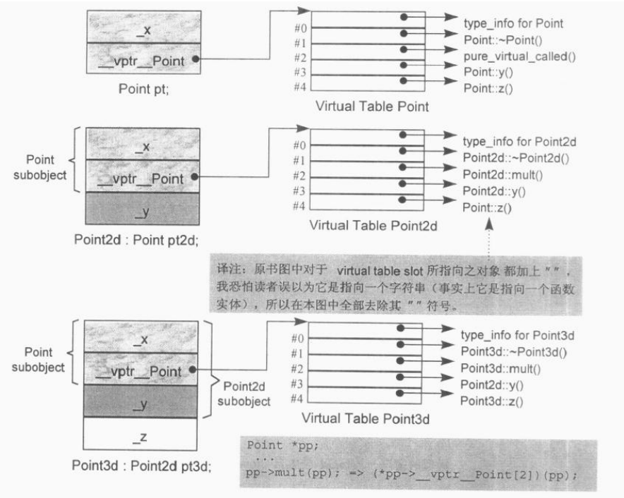

#Function语意学（The Semantics of Function）
##4.1 Member的各种调用方式
>有一种常见的观点，认为virtual functions只不过是一种跛脚的函数指针，没什么用……其意思主要就是，virtual functions是一种没有效能的形式。

###Nonstatic Member Functions（非静态成员函数）
C++的设计准则之一就是：nonstatic member function至少必须和一般的nonmember function有相同的效率。也就是说，如果我们要在以下两个函数之间做选择：

```C++
float magnitude3d(const Point3d *_this) { ... }
float Point3d::magnitude3d() const { ... }
```

那么选择member function不应该带来什么额外负担。这是因为编译器内部已将“member函数实体”转换为对等的“nonmember函数实体”。

```C++
float
Point3d::magnitude3d() const
{
	return sqrt(_x * _x + _y * _y + _z * _z);
}

float magnitude3d(const Point3d *_this) {
	return sqrt(_this->_x * _this->_x +
				_this->_y * _this->_y +
				_this->_z * _this->_z);
}
```

乍见之下似乎nonmember function比较没有效率，它间接地经由参数取用坐标成员，而member function却是直接取用坐标成员。然而实际上member function被内化为nonmember的形式。下面就是转化步骤：

（1）改写函数的signature以安插一个额外的参数到member function中，用以提供一个存取管道，使class object得以调用该函数。该额外参数被称为this指针：

```C++
// non-const nonstatic member之增长过程
Point3d
Point3d::magnitude(Point3d *const this)
```

如果member function是const，则变成：

```C++
// const nonstatic member之扩张过程
Point3d
Point3d::magnitude(const Point3d * const this)
```

（2）将每一个“对nonstatic data member的存取操作”改为经由this指针来存取：

```C++
{
	return sqrt(
		this->_x * this->_x +
		this->_y * this->_y +
		this->_z * this->_z);
}
```

（3）将member function重写成为一个外部函数，对函数名称进行mangling处理，使它在程序中成为独一无二的语汇：

```C++
extern magnitude__7Point3dFv(
	register Point3d *const this);
```

现在这个函数已经被转换好了，而其每一个调用操作也都必须转换。于是：

```C++
obj.magnitude();

===>
magnitude__7Point3dFv(&obj);

ptr->magnitude();

===>
magnitude__7Point3dFv(ptr);
```

normalized()函数定义如下，其中假设已经声明有一个Point3d copy constructor，而named returned value的优化也已施行：

```C++
Point3d
Point3d::normalize() const
{
	register float mag = magnitude();
	Point3d normal;

	normal._x = _x/mag;
	normal._y = _y/mag;
	normal._z = _z/mag;

	return normal;
}

// 以下描述named return value函数的内部转化
void
normalize__7Point3dFv(register const Point3d *const this,
						Point3d &__result)
{
	register float mag = this->magnitude();

	// default constructor
	__result.Point3d::Point3d();

	__result._x = this->_x/mag;
	__result._y = this->_y/mag;
	__result._z = this->_z/mag;

	return;
}
```

一个比较有效率的做法是直接建构normal值，像这样：

```C++
Point3d
Point3d::normalize() const
{
	register float mag = magnitude();
	return Point3d(_x/mag, _y/mag, _z/mag);
}

//内部转化，这可以节省default constructor初始化所引起的额外负担
void
normalize__7Point3dFv(register const Point3d *const this,
						Point3d &__result)
{
	register float mag = this->magnitude();

	// __result用以取代返回值
	__result.Point3d::Point3d(this->_x/mag, this->_y/mag, this->_z/mag);

	return;
}
```

####名称的特殊处理（Name Mangling）
一般而言，member的名称前面会被加上class名称，形成独一无二的命名。例如下面的声明：

```C++
class Bar { public: int ival; ... };
```

其中的ival有可能变成这样：

```C++
// member经过name-mangling之后的可能结果之一
ival__3Bar
```

为什么编译器要这么做？请考虑这样的派生操作（derivation）：

```C++
class Foo : public Bar { public: int ival; ... };
```

记住，Foo对象内部结合了base class和derived class两者：

```C++
// C++伪代码
// Foo的内部描述
class Foo {
public:
	int ival__3Bar;
	int ival__3Foo;
};
```

不管你要处理哪一个ival，通过“name mangling”，都可以绝对清楚地指出来。由于member functions可以被重载化（overloaded），所以需要更广泛的mangling手法，已提供绝对独一无二的名称。如果把：

```C++
class Point {
public:
	void x(float newX);
	float x();
	...
};
```

转换为：

```C++
class Point {
public:
	void x__5Point(float newX);
	float x__5Point();
};
```

会导致两个被重载化（overloaded）的函数实体拥有相同的名称。为了让它们独一无二，唯有再加上它们的参数链表（可以从函数原型中参考得到）。如果把参数类型也编码进去，就一定可以制造出独一无二的结果，使我们的两个x()函数有良好的转换（但如果你声明extern "C"，就会压抑nonmember functions的“mangling”效果）：

```C++
class Point {
public:
	void x__5PointFf(float newX);
	float x__5PointFv();
};
```

把参数和函数名称编码在一起，编译器于是在不同的被编译模块之间达成了一种有限形式的类型检验。举个例子，如果一个print函数被这样定义：

```C++
void print(const Point3d&) { ... }
```

但意外地被这样声明和调用：

```C++
void print(const Point3d);
```

两个实体如果拥有独一无二的name mangling，那么任何不正确的调用操作在链接时期就因无法决议而失败。有时候我们可以乐观地称此为“确保类型安全的链接行为”。我说“乐观地”是因为它只可以捕捉函数的标记（亦即函数名称+参数数目+参数类型）错误：如果“返回类型”声明错误，就没办法检查出来！

当前的编译系统中，有一种所谓的demangling工具，用来拦截名称并将其转换回去。使用者可以仍然处于“不知道内部名称”的极大幸福之中。然而生命并不是长久以来一直如此轻松，在cfront 1.1版，由于该系统未经世故，故总是收藏两种名称；编译错误消息用的是程序代码行数名称，然而链接器却不，它用的是经过mangled的内部名称。

###Virtual Member Functions（虚拟成员函数）
如果normalize()是一个virtual member function，那么以下的调用：

```C++
ptr->normalize();
```

将会被内部转化为：

```C++
(*ptr->vptr[1])(ptr);
```

其中：

- vptr表示由编译器产生的指针，指向virtual table。它被安插在每一个“声明有（或继承自）一个或多个virtual functions”的class object中。事实上其名称也会被“mangled”，因为在一个复杂的class派生体系中，可能存在有多个vptrs。
- 1是virtual table slot的索引值，关联到normalize()函数。
- 第二个ptr表示this指针。

类似的道理，如果magnitude()也是一个virtual function，它在normalize()之中的调用操作将被转换如下：

```C++
register float mag = (*this->vptr[2])(this);
```

此时，由于Point3d::magnitude()是在Point3d::normalize()中被调用，而后者已经由虚拟机制而决议妥当，所以明确地调用“Point3d实体”会比较有效率，并因此压制由于虚拟机制而产生的不必要的重复调用操作：

```C++
register float mag = Point3d::magnitude();
```

如果magnitude()声明为inline函数会更有效率。使用class scope operator明确调用一个virtual function，其决议方式会和nonstatic member function一样：

```C++
register float mag = magnitude__7Point3dFv(this);
```

对于以下调用：

```C++
// Point3d obj;
obj.normalize();
```

如果编译器把它转换为：

```C++
(*obj.vptr[1])(&obj);
```

虽然语意正确，却没有必要。经由一个class object调用一个virtual function，这种操作应该总是被编译器像对待一般的nonstatic member function一样地加以决议：

```C++
normalize__7Point3dFv(&obj);
```

这项优化工程的另一利益是，virtual function的一个inline函数实体可以被扩展开来，因而提供极大的效率利益。

###Static Member Functions（静态成员函数）
如果Point3d::normalize()是一个static member function，以下两个调用操作：

```C++
obj.normalize();
ptr->normalize();
```

将被转换为一般的nonmember函数调用，像这样：

```C++
// obj.normalize();
normalize__7Point3dSFv();
// ptr->normalize();
normalize__7Point3dSFv();
```

在C++引入static member functions之前，我想你很少看到下面这种怪异写法：

```C++
((Point3d*)0)->object_count();
```

其中的object_count()只是简单传回_object_count这个static data member。这种习惯是如何演化来的呢？

在引入static member functions之前，C++语言要求所有的member functions都必须经由该class的object来调用。而实际上，只有当一个或多个nonstatic data members在member function中被直接存取时，才需要class object。Class object提供了this指针给这种形式的函数调用使用。这个this指针把“在member function中存取的nonstatic class members”绑定于“object内对应的members”之上。如果没有任何一个members被直接存取，事实上就不需要this指针，因此也就没有必要通过一个class object来调用一个member function。不过C++语言到当前为止并不能够识别这种情况。

这么一来就在存取static data members时产生了一些不规则性。如果class的设计者把static data member声明为nonpublic，那么他就必须提供一个或多个member functions来存取该member。因此，虽然你可以不靠class object来存取一个static member，但其存取函数却得绑定于一个class object之上。

独立于class object之外的存取操作，在某个时候特别重要：当class设计者希望支持“没有class object存在”的情况时，程序方法上的解决之道是很奇特地把0强制转型为一个class指针，因而提供出一个this指针实体：

```C++
object_count((Point3d*)0);
```

至于语言层面的解决之道，是由cfront 2.0所引入的static member functions。Static member functions的主要特征就是它没有this指针。以下的次要特性统统根源于其主要特性：

- 它不能够直接存取其class中的nonstatic members。
- 它不能够被声明为const、volatile或virtual。
- 它不需要经由class object才被调用——虽然大部分时候它是这样被调用的！

“member selection”语法的使用是一种符号上的便利，它会被转化为一个直接调用操作：

```C++
if (Point3d::object_count() > 1) ...
```

如果class object是因为某个表达式而获得的，会如何呢？例如：

```C++
if (foo().object_count() > 1) ...
```

噢，这个表达式仍然需要被评估求值：

```C++
(void)foo();
if (Point3d::object_count() > 1) ...
```

一个static member function，当然会被提出于class声明之外，并给予一个经过“mangled”的适当名称。例如：

```C++
unsigned int
Point3d::
object_count()
{
	return __object_count;
}
```

会被cfront转化为：

```C++
unsigned int
object_count__5Point3dSFv()
{
	return _object_count__5Point3d;
}
```

如果取一个static member function的地址，获得的将是其在内存中的位置，也就是其地址。由于static member function的地址，获得的将是其在内存中的位置，也就是其地址。由于static member function没有this指针，所以其地址的类型并不是一个“指向class member function的指针”，而是一个“nonmember函数指针”。也就是说：

```C++
&Point3d::object_count();
```

会得到一个数值，类型是：

```C++
unsigned int (*)();
```

而不是：

```C++
unsigned int (Point3d::*)();
```

##4.2 Virtual Member Functions（虚拟成员函数）
为了支持virtual function机制，必须首先能够对于多态对象有某种形式的“执行期类型判断法”。也就是说，以下的调用操作将需要ptr在执行期的某种相关信息，

```C++
ptr->z();
```

如此一来才能够找到并调用`z()`的适当实体。

或许最直接了当但是成本最高的解决办法就是把必要的信息加在ptr身上。在这样的策略之下，一个指针（或是一个reference）含有两项信息：

1. 它所参考的对象的地址（也就是当前它所含有的东西）；
2. 对象类型的某种编码，或是某个结构（内含某些信息，用以正确决议出z()函数实例）的地址。

这个方法带来两个问题，第一，它明显增加了空间负担，即使程序并不使用多态；第二，它打断了与C程序间的链接兼容性。

如果这份额外信息不能够和指针放在一起，下一个可以考虑的地方就是把它放在对象本身。但是哪一个对象真正需要这些信息呢？我们应该把这些信息放进可能被继承的每一个聚合体身上吗？或许吧！但请考虑一下这样的C struct声明：

```C++
struct date { int m, d, y; };
```

严格地说，这符合上述规范。然而事实上它并不需要那些信息。加上那些信息将使C struct膨胀并且打破链接兼容性，却没有带来任何明显的补偿利益。

在C++中，多态表示“以一个public base class的指针（或reference），寻址出一个derived class object”的意思。

在runtime type identification（RTTI）性质于1993年被引入C++语言之前，C++对“积极多态”的唯一支持，就是对于virtual function call的决议操作。有了RTTI，就能够在执行期查询一个多态的pointer或多态的reference了。

所以，问题已经被区分出来，那就是：欲鉴定哪些classes展现多态特性，我们需要额外的执行期信息。识别一个class是否支持多态，唯一适当的方法就是看看它是否有任何virtual function。只要class拥有一个virtual function，它就需要这份额外的执行期信息。

下一个明显的问题是，什么样的额外信息是我们需要存储起来的？在实现上，首先我可以在每一个多态的class object身上增加两个members：

1. 一个字符串或数字，表示class的类型；
2. 一个指针，指向某表格，表格中带有程序的virtual functions的执行期地址。

表格中的virtual functions地址如何被构建起来？在C++中，virtual functions（可经由其class object被调用）可以在编译时期获知，此外，这一组地址是固定不变的，执行期不可能新增或替换之。由于程序执行时，表格的大小和内容都不会改变，所以其建构和存取皆可以由编译器完全掌握，不需要执行期的任何介入。

然而，执行期备妥那些函数地址，只是解答的一半而已。另一半解答是找到那些地址。以下两个步骤可以完成这项任务：

1. 为了找到表格，每一个class object被安插上一个由编译器内部产生的指针，指向该表格。
2. 为了找到函数地址，每一个virtual function被指派一个表格索引值。

这些工作都有编译器完成。执行期要做的，只是在特定的virtual table slot中激活virtual function。

一个class只会有一个virtual table。每一个table内含其对应的class object中所有active virtual functions函数实体的地址。这些active virtual functions包括：

- 这个class所定义的函数实体。它会改写一个可能存在的base class virtual function函数实体。
- 继承自base class的函数实体。这是在derived class决定不改写virtual function时才会出现的情况。
- 一个pure_virtual_called()函数实体，它既可以扮演pure virtual function的空间保卫者角色，也可以当做执行期异常处理函数。

每一个virtual function都被指派一个固定的索引值，这个索引在整个继承体系中保持与特定的virtual function的关联。例如在我们的Point class体系中：

```C++
class Point {
public:
	virtual ~Point();

	virtual Point& mult(float)=0;

	float x() const { return _x; }
	virtual float y() const { return 0; }
	virtual float z() const { return 0; }
	// ...

protected:
	Point(float x = 0.0);
	float _x;
};

class Point2d : public Point {
public:
	Point2d(float x = 0.0, float y = 0.0)
	: Point(x), _y(y) {}
	~Point2d();

	Point2d& mult(float);
	float y() const { return _y; }

protected:
	float _y;
};

class Point3d : public Point2d {
public:
	Point3d(float x = 0.0, float y = 0.0, float z = 0.0)
	: Point2d(x, y), _z(z) {}
	~Point3d();

	Point3d& mult(float);
	float z() const { return _z; }

protected:
	float _z;
};
```



在一个单一继承体系中，virtual function机制的行为十分良好，不但有效率而且很容易塑造出模型来。但是在多重继承和虚拟继承之中，对virtual functions的支持就没有那么美好了。

##多重继承下的Virtual Functions
在多重继承中支持virtual functions，其复杂度围绕在第二个及后继的base classes身上，以及“必须在执行期调整this指针”这一点。
```C++
class Base1 {
public:
	Base1();
	virtual ~Base1();
	virtual void speakClearly();
	virtual Base1 *clone() const;
protected:
	float data_Base1;
};

class Base2 {
public:
	Base2();
	virtual ~Base2();
	virtual void mumble();
	virtual Base2 *clone() const;
protected:
	float data_Base2;
};

class Derived : public Base1, public Base2 {
public:
	Derived();
	virtual ~Derived();
	virtual Derived *clone() const;
protected:
	float data_Derived;
};
```

“Derived支持virtual functions”的困难度，统统落在Base2 subobject身上。有三个问题需要解决，以此例而言分别是（1）virtual destructor，（2）被继承下来的Base2::mumble()，（3）一组clone()函数实体。

首先，我把一个从heap中配置而得的Derived对象的地址，指定给一个Base2指针：

```C++
Base2 *pbase2 = new Derived;
```

新的Derived对象的地址必须调整，以指向其Base2 subobject。编译时期会产生以下的代码：

```C++
Derived *temp = new Derived;
Base2 *pbase2 = temp ? temp + sizeof(Base1) : 0;
```

如果没有这样的调整，指针的任何“非多态运用”都将失败：

```C++
pbase2->data_Base2;
```

当程序员删除pbase2所指的对象时：

```C++
delete pbase2;
```

指针必须被再一次调整，以求再一次指向Derived对象的起始处（推测它还指向Derived对象）。然而上述的offset加法却不能够在编译时期直接设定，因为pbase2所指的真正对象只有在执行期才能确定。

一般规则是，经由指向“第二或后继之base class”的指针（或reference）来调用derived class virtual function。

```C++
Base2 *pbase2 = new Derived;
...
delete pbase2; // invoke derived class's destructor(virtual)
```

该调用操作所连带的“必要的this指针调整”操作，必须在执行期完成。也就是说，offset的大小，以及把offset加到this指针上头的那一小段程序代码。必须由编译器在某个地方插入。问题是，在哪个地方？

Bjarne原先实施于cfront编译器中的方法是将virtual table加大，使它容纳此处所需的this指针，调整相关事物。每一个virtual table slot，不再只是一个指针，而是一个聚合体，内含可能的offset以及地址。于是virtual function的调用操作由：

```C++
(*pbase2->vptr[1])(pbase2);
```

改变为：

```C++
(*pbase->vptr[1].faddr)(pbase2 + pbase2->vptr[1].offset);
```

其中faddr内含virtual function地址，offset内含this指针调整值。

这个做法的缺点是，它相当于连带处罚了所有的virtual function调用操作。不管它们是否需要offset的调整。我所谓的处罚，包括offset的额外存取及其加法，以及每一个virtual table slot的大小改变。

比较有效率的解决办法是利用所谓的thunk。Thunk技术初次引进到编译器技术中，我相信是为了支持ALGOL独一无二的pass-by-name语意。所谓thunk是一段assembly代码，用来（1）以适当的offset值调整this指针，（2）跳到virtual function去。例如，经由一个Base2指针调用Derived destructor，其相关的thunk可能看起来是这个样子：

```C++
pbase2_dtor_thunk:
	this += sizeof(base1);
	Derived::~Derived(this);
```

问题是thunk只有以assembly代码完成才有效率可言。由于cfront使用C作为其程序代码产生语言，所以无法提供一个有效率的thunk编译器。

Thunk技术允许virtual table slot继续内含一个简单的指针，因此多重继承不需要任何空间上的额外负担。Slots中的地址可以直接指向virtual function，也可以指向一个相关的thunk（如果需要调整this指针的话）。于是，对于那些不需要调整this指针的virtual function而言，就不需承载效率上的额外负担。

调整this指针的第二个额外负担就是，由于两种不同的可能：（1）经由derived class（或第一个base class）调用，（2）经由第二个（或其后继）base class调用，同一函数在virtual table中可能需要多笔对应的slots。

```C++
Base1 *pbase1 = new Derived;
Base2 *pbase2 = new Derived;

delete pbase1;
delete pbase2;
```

虽然两个delete操作导致相同的Derived destructor，但它们需要两个不同的virtual table slots：

1. pbase1不需要调整this指针（因为Base1是最左端base class之故，它已经指向Derived对象的起始处）。其virtual table slot需放置真正的destructor地址。
2. pbase2需要调整this指针。其virtual table slot需要相关的thunk地址。

在多重继承之下，一个derived class内含n-1个额外的virtual tables，n表示上一层base classes的数目（因此，单一继承将不会有额外的virtual tables）。对于本例之Derived而言，会有两个virtual tables被编译器产生出来：

1. 一个主要实体，与Base1（最左端base class）共享。
2. 一个次要实体，与Base2（第二个base class）有关。

用以支持“一个class拥有多个virtual tables”的传统方法是，将每一个tables以外部对象的形式产生出来，并给予独一无二的名称。由于执行期链接器的降临（可以支持动态链接库），符号名称的链接可能变得非常缓慢。为了调节执行期链接器的效率，Sun编译器将多个virtual tables连锁为一个；指向次要表格的指针，可由主要表格名称加上一个offset获得。在这样的策略下，每一个class只有一个具名的virtual tables。“对于许多Sun项目程序代码而言，速度的提升十分明显”。